# Broadcast Month Import System

A production-grade system for managing television broadcast revenue data with intelligent month-based import controls and historical data protection.

## Overview

This system handles the import and management of broadcast revenue data with sophisticated month-based validation and protection. It processes Excel files containing commercial spot data and provides different import modes for different operational scenarios.

### Key Features

- **🛡️ Month Closure Protection**: Permanently lock historical months to prevent accidental overwrites
- **📊 Smart Import Validation**: Different rules for weekly updates vs. historical imports
- **⚡ High Performance**: Handles 400K+ records efficiently
- **🔍 Complete Audit Trail**: Track every import with batch IDs and detailed logging
- **💰 Financial Analytics**: Rich reporting on revenue, spots, and customer metrics

## System Architecture

```
Excel File → Validation → Import Mode → Database → Reporting
     ↓           ↓           ↓           ↓         ↓
  Broadcast   Month      Weekly/      SQLite   Analytics
  Months     Closure    Historical   Database   & Status
```

### Import Modes

1. **Weekly Update**: Safe imports for ongoing operations (open months only)
2. **Historical Import**: Complete year-end data loading with auto-closure
3. **Manual Import**: Override mode with warnings for special cases

## Quick Start

### Prerequisites

- Python 3.10+
- uv package manager
- SQLite database

### Installation

```bash
# Clone repository
git clone <repository-url>
cd ctv-bookedbiz-db

# Setup virtual environment
uv venv .venv
.venv\Scripts\activate  # Windows
source .venv/bin/activate  # macOS/Linux

# Install dependencies
uv pip install -r requirements.txt

# Setup database
uv run python scripts/setup_database.py --db-path data/database/production.db
```

## Usage Guide

### 1. Weekly Operations (Recommended)

For regular weekly data updates:

```powershell
# Preview the update (dry run)
uv run python src/cli/weekly_update.py "data/weekly_data.xlsx" --dry-run

# Execute the update
uv run python src/cli/weekly_update.py "data/weekly_data.xlsx"
```

**What it does:**
- Validates that Excel contains only open (non-closed) months
- Replaces existing data for those months
- Protects all closed historical months
- Provides detailed preview and confirmation

### 2. Month Management

#### Close a Month (Make it Historical)

```powershell
# Close a month permanently
uv run python src/cli/close_month.py "Nov-24" --closed-by "Kurt" --notes "Month-end closing"

# Check month status
uv run python src/cli/close_month.py --status "Nov-24"

# List all closed months
uv run python src/cli/close_month.py --list
```

#### Month Status Information

```powershell
# Get detailed statistics for any month
uv run python src/cli/close_month.py --status "Dec-24"
```

Output example:
```
📊 Month Status: Dec-24
========================================
Status: 🔒 CLOSED
Data Statistics:
  Total spots: 24,768
  Spots with revenue: 24,768
  Unique customers: 56
  Total revenue: $305,497.16
  Average revenue: $12.33
Closure Details:
  Closed on: 2025-06-04
  Closed by: Kurt
  Notes: Month-end closing
```

### 3. Year-End Operations

For complete year-end data loading:

```powershell
# Preview historical import
uv run python src/cli/bulk_import_historical.py "data/2024_complete.xlsx" --year 2024 --closed-by "Kurt" --dry-run


# Execute historical import (imports and closes all months)
uv run python src/cli/bulk_import_historical.py "data/2024_complete.xlsx" --year 2024 --closed-by "Kurt"
uv run python src/cli/bulk_import_historical.py data/raw/2024.xlsx --year 2024 --closed-by "Kurt" --db-path data/database/production.db
```

**What it does:**
- Validates all months belong to expected year
- Imports data for all months (open and closed)
- Automatically closes all months after import
- Provides complete audit trail

## Excel File Format

Your Excel file should contain these columns:

| Column | Description | Example |
|--------|-------------|---------|
| Bill Code | Customer/Agency identifier | "Acento:City Colleges" |
| Start Date | Air date | "11/15/2024" |
| Month | Broadcast month | "11/15/2024" |
| Unit rate Gross | Revenue amount | "$12.50" |
| Sales Person | Account Executive | "John Smith" |
| Market | Market name | "NEW YORK" |
| ... | (29 total columns) | ... |

## Workflows

### Daily/Weekly Operations

```mermaid
graph TD
    A[New Excel Data] --> B[Weekly Update]
    B --> C{Contains Closed Months?}
    C -->|Yes| D[❌ BLOCKED - Clean Excel file]
    C -->|No| E[✅ Import Successful]
    E --> F[Continue Operations]
    D --> G[Remove Closed Month Data]
    G --> B
```



### Month-End Process

```mermaid
graph TD
    A[Month Complete] --> B[Final Data Import]
    B --> C[Verify Data Quality]
    C --> D[Close Month]
    D --> E[🔒 Month Protected]
    E --> F[Generate Reports]
```



### Year-End Process



```mermaid
graph TD
    A[Year-End Data] --> B[Historical Import]
    B --> C[Validate Year Match]
    C --> D[Import All Months]
    D --> E[Auto-Close All Months]
    E --> F[🔒 Year Protected]
```

## Validation Rules

### Weekly Update Mode
- ✅ **Allowed**: Excel with only open months
- ❌ **Blocked**: Excel containing any closed months
- **Reason**: Protects historical data from accidental overwrites

### Historical Import Mode
- ✅ **Allowed**: Excel with any combination of months
- ⚠️ **Warning**: Shows which months are already closed
- **Behavior**: Imports all data and closes all months

### Manual Import Mode
- ✅ **Allowed**: Excel with any combination of months
- ⚠️ **Warning**: Shows risks of importing to closed months
- **Use Case**: Special situations requiring override

## Error Handling

### Common Scenarios

| Error | Cause | Solution |
|-------|-------|----------|
| "Weekly update BLOCKED" | Excel contains closed months | Remove closed month data or use historical import |
| "Invalid broadcast month format" | Date parsing error | Check Excel date formats |
| "Database not found" | Missing database file | Run setup_database.py |
| "No data exists for this month" | Trying to close empty month | Import data first |

### Example Error Message

```
❌ Weekly update cannot proceed due to validation errors
💡 Common solutions:
  • Remove closed month data from Excel file
  • Use historical import mode for closed months
  • Check if months need to be manually closed first
```

## Monitoring & Audit

### Import History

```powershell
# View recent import history
uv run python src/services/broadcast_month_import_service.py --history
```

### Batch Tracking

Every import generates a unique batch ID for audit purposes:
- `weekly_1749056017` - Weekly update batch
- `historical_1749056872` - Historical import batch
- `manual_1749056017` - Manual import batch

### Performance Metrics

Typical performance:
- **Import Speed**: 250+ records/second
- **Validation**: 400K+ records in <1 second  
- **Database Size**: Efficient storage with proper indexing

## Database Schema

### Key Tables

- **`spots`**: Core transactional data with all Excel columns
- **`month_closures`**: Tracks which months are permanently closed
- **`import_batches`**: Complete audit trail of all imports
- **`customers`**: Normalized customer data
- **`agencies`**: Agency relationship data

### Month Protection Implementation

```sql
-- Spots are marked as historical when month is closed
UPDATE spots SET is_historical = 1 WHERE broadcast_month = ?

-- Closed months are tracked separately
INSERT INTO month_closures (broadcast_month, closed_date, closed_by, notes)
```

## Advanced Usage

### Custom Database Path

```powershell
uv run python src/cli/weekly_update.py "data.xlsx" --db-path "custom/path/database.db"
```

### Limiting Records (Testing)

```powershell
uv run python src/importers/enhanced_production_importer.py "data.xlsx" --limit 100
```

### Verbose Logging

```powershell
uv run python src/cli/close_month.py --status "Nov-24" --verbose
```

## Production Checklist

### Before Going Live

- [ ] Database properly initialized with `setup_database.py`
- [ ] Test import with sample data
- [ ] Verify month closure workflow
- [ ] Confirm Excel file format compatibility
- [ ] Test validation scenarios
- [ ] Set up regular backup procedures

### Monthly Process

- [ ] Import weekly data throughout month
- [ ] Verify data quality before month-end
- [ ] Close month when finalized
- [ ] Generate monthly reports
- [ ] Archive Excel files with batch IDs

### Year-End Process

- [ ] Compile complete year data
- [ ] Run historical import with dry-run first
- [ ] Verify all months are properly closed
- [ ] Generate annual reports
- [ ] Archive complete dataset

## Troubleshooting

### Common Issues

**Import Fails with Date Parsing Errors**
```powershell
# Check Excel date formats - should be MM/DD/YYYY or similar
# Verify 'Month' column exists and contains dates
```

**Weekly Update Blocked**
```powershell
# Check which months are closed
uv run python src/cli/close_month.py --list

# Remove closed month data from Excel file
# Or use historical import mode instead
```

**Database Errors**
```powershell
# Recreate database if corrupted
uv run python scripts/setup_database.py --db-path data/database/production.db --verify
```

## Support

For issues or questions:
1. Check the error message and suggested solutions
2. Review the validation rules above
3. Use `--verbose` flag for detailed logging
4. Check import history for batch tracking

## License

Proprietary - Internal Use Only

---

*This system manages millions of dollars in broadcast revenue data with enterprise-grade reliability and protection.*