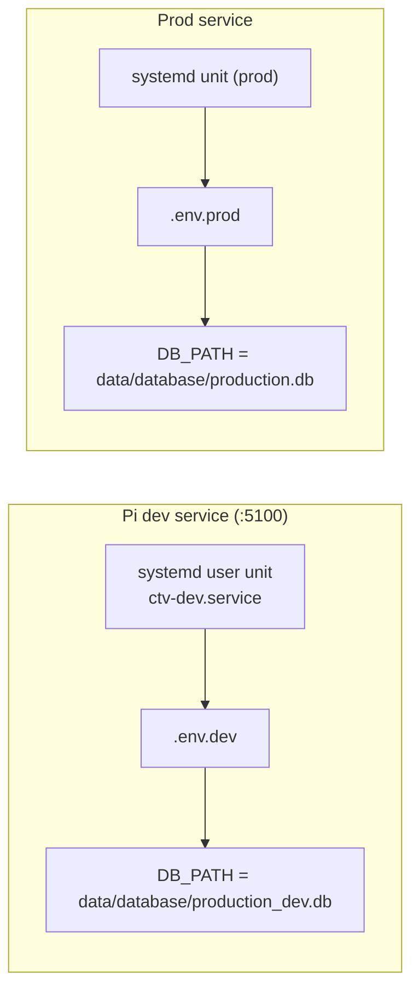

Awesome. I’ll draft two deliverables for you right now:

1. `docs/git_workflow.md` – human-facing doc with diagrams and captions
2. `docs/assets/git_flow.svg` – an SVG you can commit (this will just be inline SVG markup you can save as a file)

You can paste these directly into your repo.

---

## 1. `docs/git_workflow.md`

````markdown
# CTV BookedBiz Git + Deploy Flow

This doc explains how code moves from a feature branch on the Pi to `dev`, then to `main`, and finally into production. It also shows which database/environment each step is using.

---

## 1. High-level branch flow

```mermaid
flowchart LR
    subgraph Feature["Feature Branch (feat/<owner>/<slug>)"]
        A1[Local changes<br/>ruff check / ruff format] --> A2[Commit + push]
        A2 --> A3[Open PR → dev]
    end

    subgraph Dev["dev branch"]
        B1[Merge PR] --> B2[Pi dev service on :5100<br/>ENV=.env.dev<br/>DB=production_dev.db]
        B2 --> B3[Validate on Pi]
        B3 --> B4[Open PR dev → main]
    end

    subgraph Main["main branch"]
        C1[Squash merge] --> C2[Pull on prod box<br/>ENV=.env.prod<br/>DB=production.db]
        C2 --> C3[Restart prod service]
    end

    Feature --> Dev --> Main
````

**Read it like this:**

* You do work on a short-lived branch named `feat/<owner>/<slug>`.
* That work is merged into `dev` first and tested on the Pi’s dev service (port `5100`, using the dev DB).
* Once dev looks good, `dev` is merged into `main` via **Squash merge**.
* `main` is then pulled on the production instance and the prod service is restarted.

---

## 2. Day-to-day loop (timeline)

```mermaid
flowchart TD
    S1["1. Sync dev\n git switch dev && git pull --ff-only"]
    S2["2. Create feature branch\n git switch -c feat/<you>/<slug>"]
    S3["3. Code / test locally\n uvx ruff check .\n uvx ruff format ."]
    S4["4. Commit + push\n git add -A && git commit -m '...'\n git push -u origin HEAD"]
    S5["5. Open PR: base=dev, compare=feat/..."]
    S6["6. After merge, pull dev on Pi\n git switch dev && git pull --ff-only"]
    S7["7. Restart dev service\n systemctl --user restart ctv-dev.service"]
    S8["8. Health check\n curl -sf http://localhost:5100/health/ && echo DEV_OK"]
    S9["9. If OK, open PR dev → main (Squash merge)"]
    S10["10. On prod box\n git switch main && git pull --ff-only"]
    S11["11. Restart prod service"]

    S1 --> S2 --> S3 --> S4 --> S5 --> S6 --> S7 --> S8 --> S9 --> S10 --> S11

```

This is basically:
**sync dev → branch → code → PR to dev → verify on :5100 → PR dev→main → pull main for prod.**

---

## 3. Environment / DB mapping



**Key idea:**
The service that runs on port `5100` is *not allowed to touch* `production.db`.
It should always point at `production_dev.db`.

To refresh `production_dev.db` from prod safely:

```bash
systemctl --user stop ctv-dev.service
sqlite3 data/database/production.db ".backup 'data/database/production_dev.db'"
systemctl --user start ctv-dev.service
```

---

## 4. Glossary

**feat/<owner>/<slug>**
Short-lived feature branch. Example: `feat/jenna/report-cleanup`.

**dev**
Integration branch. Anything here should be runnable on the Pi using the dev DB (`production_dev.db`) through `ctv-dev.service` on port `5100`.

**main**
Production branch. Squash-merged from `dev`. This is what gets pulled to the production environment and run against the real DB (`production.db`).

**Squash merge**
GitHub turns a whole PR into one clean commit instead of a pile of tiny commits. This keeps `main` history readable.

**git pull --ff-only**
“Fast-forward only.” This refuses to create merge commits on the Pi. If it fails, you need to rebase instead of creating weird local merges.

---

## 5. Operator checklist

### After merging a feature branch into `dev`:

```bash
git switch dev
git pull --ff-only
systemctl --user restart ctv-dev.service
curl -sf http://localhost:5100/health/ && echo DEV_OK
```

### After merging `dev` → `main`:

```bash
git switch main
git pull --ff-only
# then restart prod service on the box that serves prod
```

If you follow that, `main` always represents “what prod is actually running,” and `dev` always represents “what we’re testing on :5100”.

````

---

## 2. `docs/assets/git_flow.svg`

Save the following as `docs/assets/git_flow.svg`. This is a static version of the branch flow for slides / onboarding / emailing someone who doesn’t read mermaid.

```xml
<svg xmlns="http://www.w3.org/2000/svg" width="960" height="360" viewBox="0 0 960 360" font-family="Inter, -apple-system, BlinkMacSystemFont, 'Segoe UI', Roboto, sans-serif">
  <style>
    .stage-box {
      fill: #0f172a;
      stroke: #1e293b;
      stroke-width: 2;
      rx: 12;
    }
    .stage-title {
      font-size: 14px;
      font-weight: 600;
      fill: #38bdf8;
    }
    .stage-body {
      font-size: 12px;
      font-weight: 400;
      fill: #f8fafc;
    }
    .arrow {
      stroke: #475569;
      stroke-width: 2.5;
      marker-end: url(#arrowhead);
      fill: none;
    }
    .label {
      font-size: 11px;
      font-weight: 500;
      fill: #94a3b8;
    }
    .pill {
      fill: #1e293b;
      stroke: #334155;
      stroke-width: 1.5;
      rx: 6;
    }
    .pill-text {
      font-size: 11px;
      font-weight: 500;
      fill: #e2e8f0;
    }
  </style>

  <defs>
    <marker id="arrowhead" markerWidth="8" markerHeight="8" refX="6" refY="3" orient="auto">
      <path d="M0,0 L6,3 L0,6 Z" fill="#475569"/>
    </marker>
  </defs>

  <!-- Feature stage -->
  <rect class="stage-box" x="40" y="60" width="260" height="200" />
  <text class="stage-title" x="60" y="88">Feature Branch</text>
  <text class="stage-body" x="60" y="110">name: feat/&lt;owner&gt;/&lt;slug&gt;</text>
  <text class="stage-body" x="60" y="130">work locally on Pi or VS Code</text>
  <text class="stage-body" x="60" y="150">run: ruff check / ruff format</text>
  <text class="stage-body" x="60" y="170">commit + push</text>
  <text class="stage-body" x="60" y="190">open PR → dev</text>

  <!-- Dev stage -->
  <rect class="stage-box" x="350" y="60" width="260" height="200" />
  <text class="stage-title" x="370" y="88">dev branch</text>
  <text class="stage-body" x="370" y="110">merge PR from feat/*</text>
  <text class="stage-body" x="370" y="130">pull on Pi: <tspan font-weight="600">git pull --ff-only</tspan></text>
  <text class="stage-body" x="370" y="150">service: ctv-dev.service (:5100)</text>
  <text class="stage-body" x="370" y="170">env: .env.dev</text>
  <text class="stage-body" x="370" y="190">DB: production_dev.db</text>
  <text class="stage-body" x="370" y="210">if healthy → PR dev → main</text>

  <!-- Main stage -->
  <rect class="stage-box" x="660" y="60" width="260" height="200" />
  <text class="stage-title" x="680" y="88">main branch</text>
  <text class="stage-body" x="680" y="110">Squash merge from dev</text>
  <text class="stage-body" x="680" y="130">on prod box:</text>
  <text class="stage-body" x="700" y="150">git switch main</text>
  <text class="stage-body" x="700" y="170">git pull --ff-only</text>
  <text class="stage-body" x="700" y="190">restart prod service</text>
  <text class="stage-body" x="680" y="210">env: .env.prod / DB: production.db</text>

  <!-- Arrows -->
  <line class="arrow" x1="300" y1="160" x2="350" y2="160"/>
  <line class="arrow" x1="610" y1="160" x2="660" y2="160"/>

  <!-- Legend pills -->
  <rect class="pill" x="60" y="280" width="110" height="26" />
  <text class="pill-text" x="70" y="297">Pi dev service</text>

  <rect class="pill" x="200" y="280" width="170" height="26" />
  <text class="pill-text" x="210" y="297">:5100 / .env.dev / production_dev.db</text>

  <rect class="pill" x="400" y="280" width="200" height="26" />
  <text class="pill-text" x="410" y="297">main == production reality</text>

  <!-- Row labels under arrows -->
  <text class="label" x="305" y="150">PR → dev</text>
  <text class="label" x="615" y="150">PR dev → main</text>
</svg>
````

---

How to use this:

* Commit `docs/git_workflow.md` and `docs/assets/git_flow.svg`.
* Link to both from `GUIDE_DEV_WORKFLOW.md` near the top with one line like:
  `For a visual map of branches and promotion, see docs/git_workflow.md.`

That gives you:

* human steps (already in GUIDE_DEV_WORKFLOW.md),
* dev-facing visuals in `docs/git_workflow.md`,
* a clean SVG for onboarding decks / sending to someone new.
