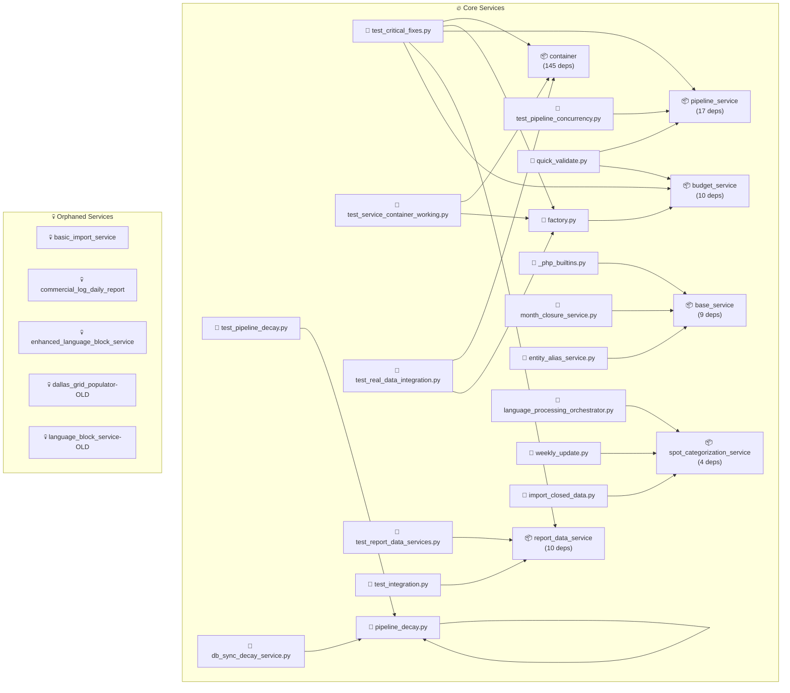

# Simplified Service Dependencies

## 🎯 Quick Actions

### 🗑️ Safe to Delete (Orphaned Services)
```bash
# These services appear to be unused:
rm src/services/basic_import_service.py  # basic_import_service
rm src/services/commercial_log_daily_report.py  # commercial_log_daily_report
rm src/services/enhanced_language_block_service.py  # enhanced_language_block_service
rm src/services/old/dallas_grid_populator-OLD.py  # dallas_grid_populator-OLD
rm src/services/old/language_block_service-OLD.py  # language_block_service-OLD
```

### 🔥 Most Connected Services

| Service | Dependencies | Status |
|---------|-------------|---------|
| `container` | 145 files | 🔥 Heavily Used |
| `factory` | 119 files | 🔥 Heavily Used |
| `pipeline_service` | 17 files | 🔥 Heavily Used |
| `report_data_service` | 10 files | 🔥 Heavily Used |
| `pipeline_decay` | 10 files | 🔥 Heavily Used |
| `budget_service` | 10 files | 🔥 Heavily Used |
| `base_service` | 9 files | 🔥 Heavily Used |
| `spot_categorization_service` | 4 files | ⚡ Well Used |
| `month_closure_service` | 4 files | ⚡ Well Used |
| `import_integration_utilities` | 4 files | ⚡ Well Used |

## 🗺️ Core Service Dependencies (Top 8)



## 📋 Complete Service List

### ✅ Used Services
- 📦 **ae_service** (4 dependencies)
- 📦 **base_service** (9 dependencies)
- 📦 **bill_code_parser** (1 dependencies)
- 📦 **broadcast_month_import_service** (3 dependencies)
- 📦 **budget_service** (10 dependencies)
- 📦 **business_rules_service** (2 dependencies)
- 📦 **container** (145 dependencies)
- 📦 **customer_service** (2 dependencies)
- 📦 **data_import_service** (1 dependencies)
- 📦 **db_sync_decay_service** (2 dependencies)
- 📦 **entity_alias_service** (1 dependencies)
- 📦 **factory** (119 dependencies)
- 📦 **import_integration_utilities** (4 dependencies)
- 📦 **language_assignment_service** (3 dependencies)
- 📦 **language_processing_orchestrator** (3 dependencies)
- 📦 **month_closure_service** (4 dependencies)
- 📦 **pipeline_decay** (10 dependencies)
- 📦 **pipeline_service** (17 dependencies)
- 📦 **report_data_service** (10 dependencies)
- 📦 **review_session_management** (1 dependencies)
- 📦 **spot_categorization_service** (4 dependencies)
- 📦 **standard_grid_populator** (1 dependencies)

### ❌ Orphaned Services
- 💀 **basic_import_service** (`src/services/basic_import_service.py`)
- 💀 **commercial_log_daily_report** (`src/services/commercial_log_daily_report.py`)
- 💀 **enhanced_language_block_service** (`src/services/enhanced_language_block_service.py`)
- 💀 **dallas_grid_populator-OLD** (`src/services/old/dallas_grid_populator-OLD.py`)
- 💀 **language_block_service-OLD** (`src/services/old/language_block_service-OLD.py`)

## 🛠️ Cleanup Commands

```bash
# Review orphaned services before deletion:
git log --oneline src/services/basic_import_service.py  # Check recent changes to basic_import_service
git log --oneline src/services/commercial_log_daily_report.py  # Check recent changes to commercial_log_daily_report
git log --oneline src/services/enhanced_language_block_service.py  # Check recent changes to enhanced_language_block_service
git log --oneline src/services/old/dallas_grid_populator-OLD.py  # Check recent changes to dallas_grid_populator-OLD
git log --oneline src/services/old/language_block_service-OLD.py  # Check recent changes to language_block_service-OLD

# If confirmed unused, delete them:
rm src/services/basic_import_service.py
rm src/services/commercial_log_daily_report.py
rm src/services/enhanced_language_block_service.py
rm src/services/old/dallas_grid_populator-OLD.py
rm src/services/old/language_block_service-OLD.py
```
